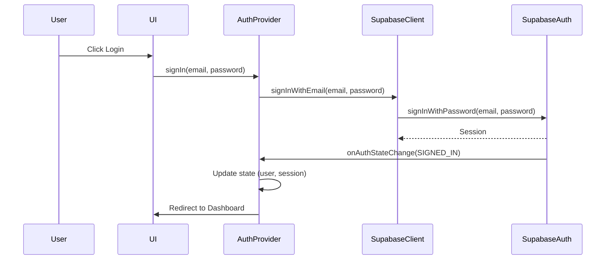
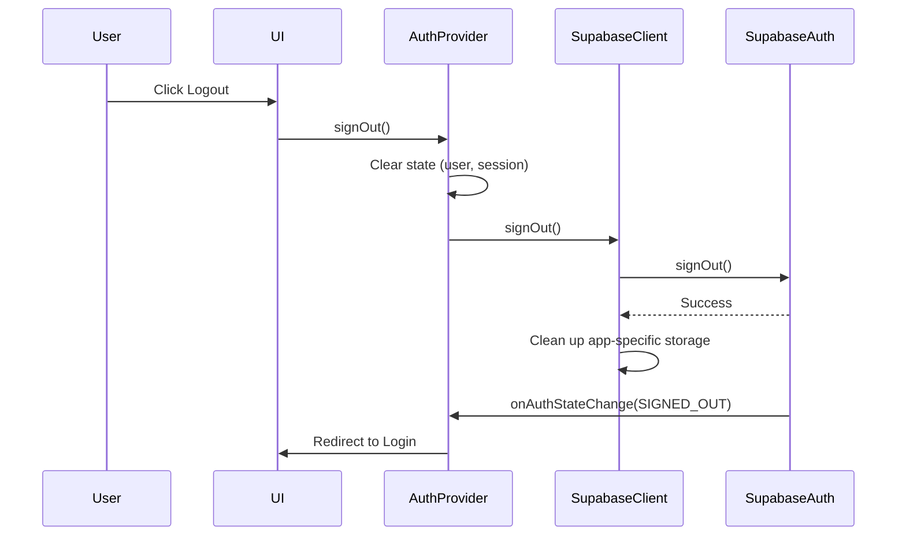

# OxiNews Authentication System Documentation

## Overview

The OxiNews authentication system is built on top of Supabase Auth and provides a secure, reliable way to manage user authentication in the application. This document explains the architecture, components, and best practices for working with the authentication system.

## Architecture

The authentication system consists of three main components:

1. **AuthProvider**: A React context provider that manages authentication state and provides authentication methods to the rest of the application.
2. **Supabase Client**: A wrapper around the Supabase client that provides authentication methods and handles session management.
3. **DashboardLayout**: A component that uses the AuthProvider to handle user logout.

### Authentication Flow



### Logout Flow



## Components

### AuthProvider

The `AuthProvider` is a React context provider that manages authentication state and provides authentication methods to the rest of the application. It is responsible for:

- Managing authentication state (user, session, status)
- Providing authentication methods (signIn, signUp, signOut)
- Handling authentication events (onAuthStateChange)
- Managing navigation based on authentication state

#### Key Features

- **Mutex Pattern**: Uses a mutex pattern with timeout protection to prevent race conditions during state updates.
- **Session Expiration Handling**: Checks for session expiration before performing any authentication operations.
- **Atomic State Updates**: Ensures that state updates are atomic to prevent inconsistent state.
- **Promise-based Navigation**: Uses promises instead of timeouts to ensure navigation happens after state updates.

### Supabase Client

The Supabase client wrapper provides authentication methods and handles session management. It is responsible for:

- Initializing the Supabase client with the correct configuration
- Providing authentication methods (signInWithEmail, signUpWithEmail, signOut)
- Managing session storage
- Handling OAuth authentication

#### Key Features

- **Enhanced Storage Adapter**: Provides a robust storage adapter that safely handles SSR and ensures persistence.
- **Atomic Storage Operations**: Ensures that storage operations are atomic to prevent race conditions.
- **Error Handling**: Provides comprehensive error handling for authentication operations.

## Best Practices

### Using Authentication in Components

To use authentication in your components, import the `useAuth` hook from the AuthProvider:

```tsx
import { useAuth } from "@/components/providers/AuthProvider";

function MyComponent() {
  const { user, status, signIn, signOut } = useAuth();

  // Check if user is authenticated
  if (status === 'loading') {
    return <div>Loading...</div>;
  }

  if (status === 'unauthenticated') {
    return <div>Please log in</div>;
  }

  return (
    <div>
      <p>Welcome, {user?.email}</p>
      <button onClick={signOut}>Logout</button>
    </div>
  );
}
```

### Handling Authentication Events

The AuthProvider handles authentication events automatically. When a user signs in or out, the AuthProvider will update the authentication state and redirect the user to the appropriate page.

### Preventing Race Conditions

The authentication system uses several techniques to prevent race conditions:

1. **Mutex Pattern**: The AuthProvider uses a mutex pattern with timeout protection to prevent race conditions during state updates.
2. **Atomic State Updates**: The AuthProvider ensures that state updates are atomic to prevent inconsistent state.
3. **Promise-based Navigation**: The AuthProvider uses promises instead of timeouts to ensure navigation happens after state updates.
4. **Session Expiration Checking**: The AuthProvider checks for session expiration before performing any authentication operations.

### Common Pitfalls

1. **Directly Using Supabase Auth**: Always use the AuthProvider's methods instead of directly using Supabase Auth to ensure proper state management.
2. **Multiple Logout Handlers**: Avoid implementing multiple logout handlers. Use the AuthProvider's signOut method for all logout operations.
3. **Timeouts for Navigation**: Avoid using timeouts for navigation after authentication operations. Use the AuthProvider's methods which handle navigation properly.

## Troubleshooting

### User is not redirected after login/logout

This could be due to a race condition in the authentication state. Make sure you're using the AuthProvider's methods for authentication operations and not directly using Supabase Auth.

### Session is lost after page refresh

Check if the session is being properly stored in localStorage. The AuthProvider should handle this automatically, but if you're seeing issues, check the browser's localStorage for any auth-related items.

### Multiple redirects during logout

This could be due to multiple logout handlers being triggered. Make sure you're only using the AuthProvider's signOut method for logout operations.

## Security Considerations

1. **Session Expiration**: The AuthProvider checks for session expiration before performing any authentication operations. If a session is expired, the user will be automatically logged out.
2. **PKCE Flow**: The Supabase client is configured to use PKCE flow for OAuth authentication, which is more secure than the implicit flow.
3. **Storage Security**: The authentication system uses localStorage for session storage, which is vulnerable to XSS attacks. Make sure your application is protected against XSS attacks.
